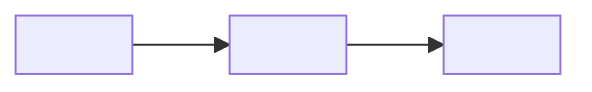

# Design

Designer: <name> (@<handle>). Owned by the designer: to change anything here, open a
change-request (AGENTS.md §7) addressed to them. Each vertical's `Design:` line says which
sections of this page it must follow.

## Flow

## Screens and commands

| Screen or command | Shows | The user can |
|---|---|---|
| <name> | <what is on it> | <actions> |

## States

| Where | Empty | Loading | Error |
|---|---|---|---|
| <screen or command> | <what shows> | <what shows> | <message and what to do> |

## Copy

| Where | Words |
|---|---|
| <heading, button or message> | "<exact text>" |
